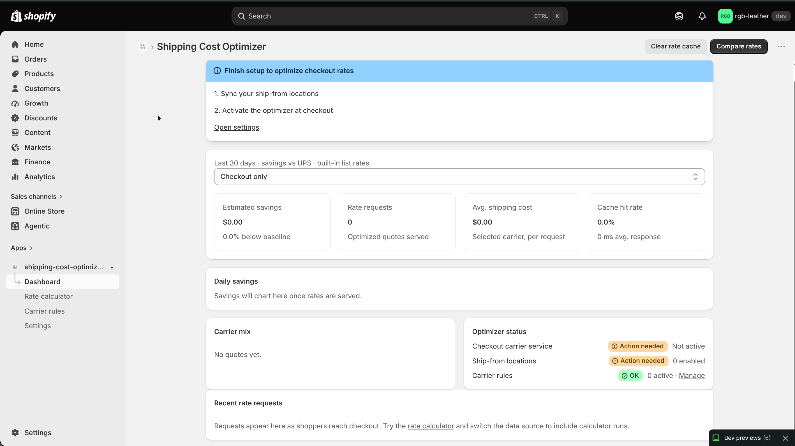
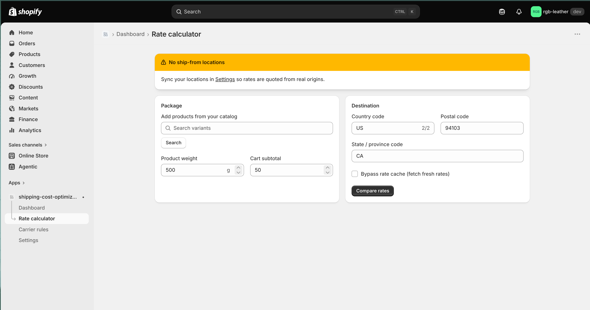
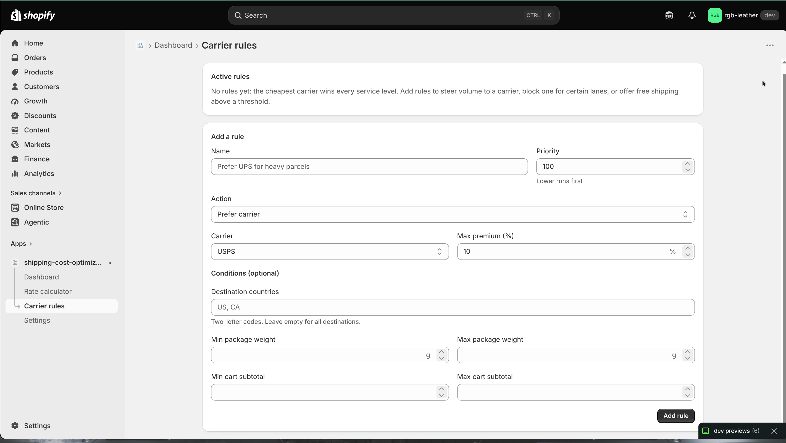
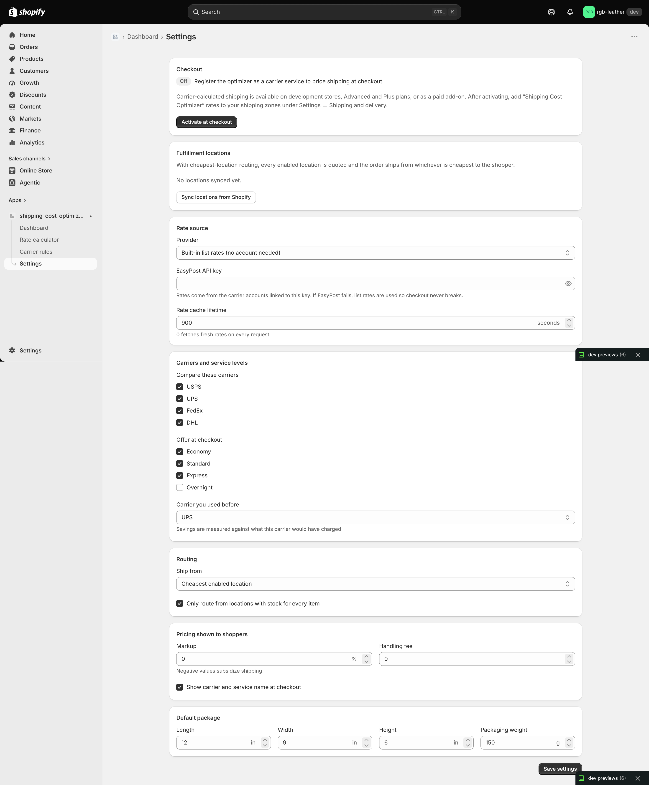

# Shipping Cost Optimizer

A Shopify app that prices shipping at checkout. It compares USPS, UPS, FedEx and DHL from every enabled location and shows shoppers the cheapest rate for each service level.



## What it does

Most stores ship with one carrier from one warehouse, even when a different carrier or location would be cheaper for a given parcel and address. This app plugs into checkout as a **carrier service**. When a shopper enters an address, Shopify sends the cart to the app. The app quotes every carrier service from every enabled location, applies your rules, and returns one rate per service level (Economy, Standard, Express and, optionally, Overnight).

The dashboard shows how much you saved compared with the carrier you used before, which carriers are winning, and recent rate requests.

## How to use it

1. Open **Settings** and click **Sync locations from Shopify**. Turn individual locations on or off with **Enable** / **Disable**.
2. Under **Rate source**, keep **Built-in list rates (no account needed)** or choose **EasyPost live rates** and paste an **EasyPost API key**.
3. Under **Carriers and service levels**, pick the carriers to compare, the levels to **Offer at checkout**, and the **Carrier you used before**. Savings are measured against that carrier.
4. Set **Routing**, **Pricing shown to shoppers** (markup, handling fee) and **Default package**, then click **Save settings**.
5. Click **Activate at checkout**. In Shopify admin, go to **Settings → Shipping and delivery** and add the "Shipping Cost Optimizer" rates to a shipping zone.
6. Optional: open **Carrier rules** and click **Add rule** to change which carrier wins or what shoppers pay.
7. Open **Rate calculator** (or click **Compare rates** on the dashboard) to test a package and destination before shoppers see it.
8. Watch the **Dashboard**. Switch **Data source** to **Checkout + calculator** to include calculator runs.

Carrier-calculated shipping only works on development stores, Advanced and Plus plans, or as a paid add-on.

## Features

- **Dashboard:** 30-day estimated savings, rate requests, average shipping cost, cache hit rate and response time. Also a daily savings chart, carrier mix, optimizer status checklist, recent rate requests and a **Clear rate cache** button.
- **Rate calculator:** search products or enter a weight, set a cart subtotal and destination, and see the rate the shopper would get per level, which carrier won, the savings, any rules applied and which location it ships from. **Bypass rate cache** fetches fresh quotes.
- **Carrier rules:** five actions: *Never use carrier*, *Prefer carrier* (if within X% of the cheapest), *Hide service level*, *Free shipping*, *Adjust customer price*. Rules can be limited by destination country, package weight and cart subtotal, and run by priority (lower first). Each rule can be paused, resumed or deleted.
- **Settings:** activate or remove the checkout carrier service, sync locations, rate source, carriers and service levels, baseline carrier, routing mode, markup and handling fee, whether to show carrier names at checkout, and default box size and packaging weight.
- **Location routing:** **Cheapest enabled location** quotes every enabled location and ships from the cheapest. With **Only route from locations with stock for every item**, locations that can't fill the whole cart are skipped. **Location Shopify chooses** uses the origin Shopify sends instead.
- **Checkout endpoint security:** each shop gets a secret token in its callback URL. The HMAC signature is verified when Shopify sends one.

## How it works

- **Billable weight** = the greater of actual weight and dimensional weight (`L × W × H ÷ divisor`, 139 or 166 depending on the carrier), rounded up to a whole pound. Packaging weight is added to the product weight.
- **Zones:** for US addresses, the distance between ZIP-region centroids maps to zones 1–8. Different countries count as international.
- **Built-in list rates:** `base + perLb × lbs + zoneStep × (zone − 1) × √lbs` across 15 services. These rates are example figures, not real carrier tariffs. If EasyPost fails or times out (4 s), the app uses the built-in rates so checkout never breaks.
- **Selection:** for each service level, excluded carriers are removed and the cheapest quote wins unless a *Prefer carrier* rule's carrier is within its tolerance. Shopper price = `cost × (1 + markup%) + handling fee`, then any *Adjust customer price* rules, then *Free shipping*.
- **Savings** = what the baseline carrier would charge from the location Shopify would have used, minus the chosen cost, so routing savings count too. One shipment (Standard, or the first offered level) is logged per request.
- **Caching:** quotes are cached in memory per shop, route (origin and destination country and ZIP), weight in ounces and box size, for the **Rate cache lifetime** you set (0 turns it off). Stock lookups are cached for 60 s and capped at 2.5 s per checkout.

## Screenshots

| Rate calculator | Carrier rules |
| --- | --- |
|  |  |

| Settings |
| --- |
|  |

## Tech stack

React Router app template, Polaris web components, Prisma + SQLite. Admin GraphQL API `2026-07`, scopes `write_shipping, read_locations, read_inventory, read_products`.

## Run locally

Requires Node 22.12+ and the [Shopify CLI](https://shopify.dev/docs/apps/tools/cli).

```sh
npm install
npm run setup
npm run dev
```

`npm run dev` sets `SHOPIFY_API_KEY`, `SHOPIFY_API_SECRET`, `SHOPIFY_APP_URL` and `SCOPES` for you. The EasyPost API key goes in the app's Settings page, not in an env var.

| Variable | Purpose |
| --- | --- |
| `SHOP_CUSTOM_DOMAIN` | Allow a custom shop domain in addition to `*.myshopify.com` |
| `NODE_ENV` | Set to `production` for production builds |
